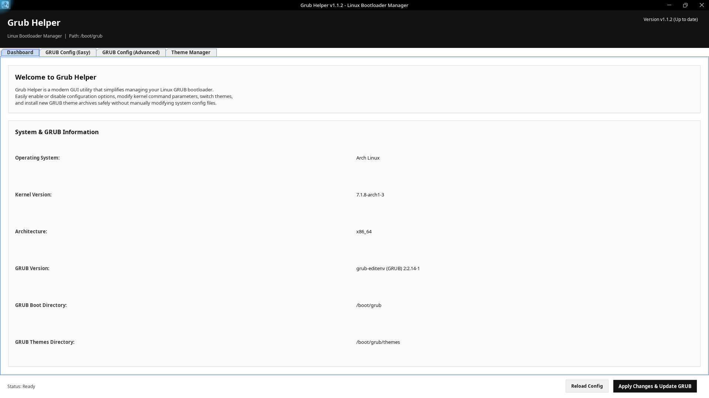
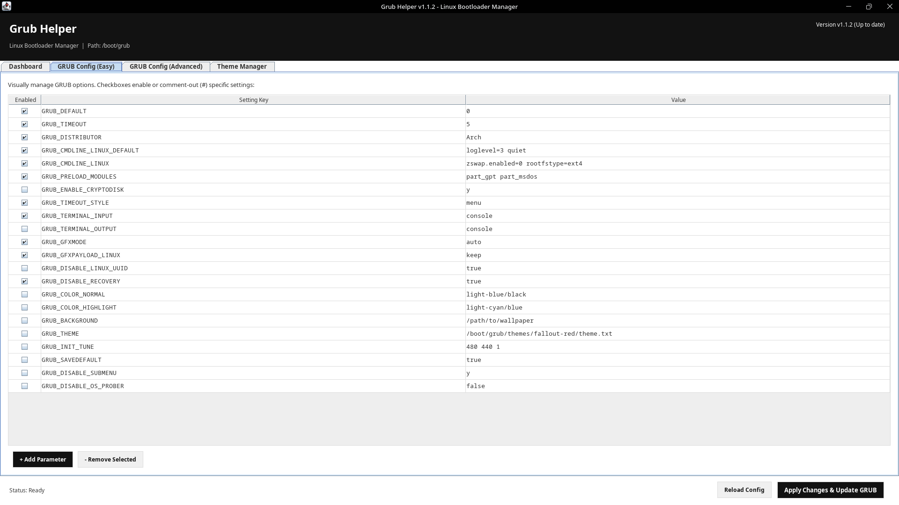
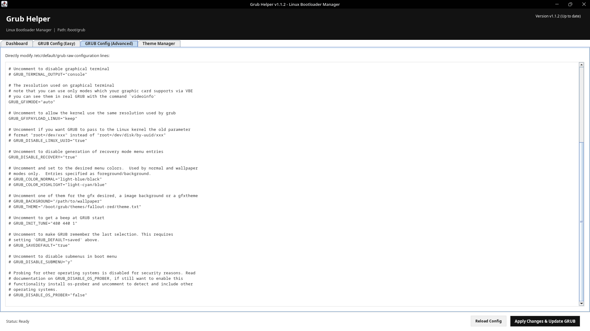
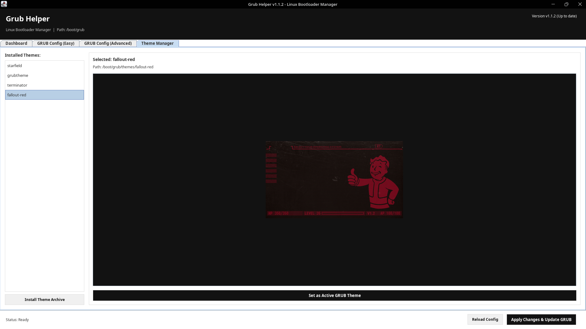

### Application Preview

| Main Interface | Config editor easy |
| :-: | :-: |
|  |  |

| Config Editor advanced | theme selector |
| :-: | :-: |
|  |  |


# Grub Helper

**Grub Helper** is a simple GUI application that makes configuring Grub Bootloader easier
---

## Features

-**easy and advanced config editor based on user skill and preference.**
-**easy theme installer and selector to install or switch themes without hassle.**

---

## Installation

Run `install.sh` from the cloned repository:

```bash
git clone https://github.com/ZimnyySTD/Grub-Helper.git
cd Grub-Helper
chmod +x install.sh
./install.sh
```

The installer detects your Linux distribution package manager (`apt`, `pacman`, `dnf`, `zypper`), installs required dependencies, builds the application, and sets up a launcher shortcut and application menu entry.

---

## Running the App

Launch **Grub Helper** from your application menu or run from terminal:

```bash
grub-helper
```

## please note that Grub Helper was only tested on arch linux, so on other distros, there might be bugs. please leave feednback!

For developer documentation and internal technical architecture, see [READ-DEV.md](READ-DEV.md). For publishing releases, see [UPDATE.md](UPDATE.md).
